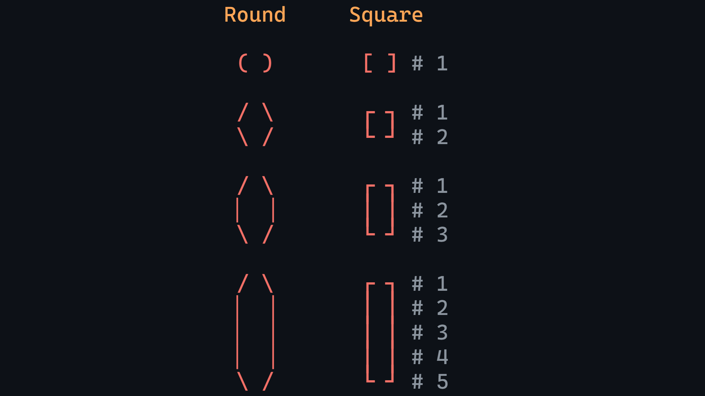

# PrettyStringRenderer

A high-fidelity monospace canvas engine for symbolic art and code visualization. Transforms ASCII / Unicode text into colorized, high-resolution string-art suitable for screenshots, illustrations, or vector export.

---

## Table of Contents

- [Features](#features)
- [Getting Started](#getting-started)
  - [Requirements](#requirements)
  - [Install Dependencies](#install-dependencies)
  - [Run Locally](#run-locally)
- [Usage \& Shortcuts](#usage--shortcuts)
- [Export Options](#export-options)
- [Personalization](#personalization)
  - [Theme format](#theme-format)
- [String-Art Syntax](#string-art-syntax)
  - [Bracket Logic](#bracket-logic)
  - [Limitations](#limitations)
- [Project Structure](#project-structure)
- [Contributing](#contributing)
- [License](#license)

---

## Features

- **Incremental tokenizer**: High-performance engine that only re-tokenizes changed lines.
- **Structural bracket support**: Inline and multiline bracket families with automatic nesting color cycles.
- **High-resolution export**: **PNG** at custom scale multipliers and editable **SVG** files.
- **Configurable workflow**: Theme system, and gitignored `user.profile.json` for personalization.
- **Persistent state**: Progress is automatically cached to `localStorage`.

---

## Getting Started

### Requirements

- [Node.js](https://nodejs.org/)
- **Recommended**: [Visual Studio Code](https://code.visualstudio.com/) with the [Vite extension](https://marketplace.visualstudio.com/items?itemName=antfu.vite) for one-click dev server control.

---

### Install Dependencies

```bash
npm install
```

---

### Run Locally

Start dev server:

- **Via VS Code**: Click the **Vite** button in the status bar.
- **Via Terminal**: Run `npm run dev`, access at `http://localhost:5173`.

---

## Usage & Shortcuts

Start typing in the canvas editor.

### Editor <!-- omit in toc -->

- `Ctrl+Z` / `Ctrl+Shift+Z` to **undo** / **redo**.
- `click-and-drag` the resize handle to **adjust height**.
- `double-click` the resize handle to **reset height**.

### Canvas <!-- omit in toc -->

- `Esc` to focus the **Canvas**.
- Hold `Alt` + `scroll-wheel` to zoom.
- Hold `Space` + drag (or `right-click-and-drag`) to pan.
- `double-click` the canvas to reset view.

### Theme panel <!-- omit in toc -->

- `Tab` to focus the **Theme panel**.
- `ArrowUp` / `ArrowDown` to navigate themes.
- `double-click` a theme file to open it in a new window.
- Click the **Load themes** button to import and overwrite themes.
- Click the **Export theme** button to export the current colors.

### Workspace / Export <!-- omit in toc -->

- `Ctrl+S` (or click the **Export** button) to open the export dialog.
- Click the **Reset** button to reset workspace (clears theme selection & view state).

---

## Export Options

- **PNG**: raster export with scale multipliers (`1`, `2`, `0.5`, etc)
- **SVG**: vector export where tokens are grouped by color; fonts are embedded as attributes so SVGs are editable in Figma, Adobe Illustrator, Inkscape, etc.

## Personalization

Create a local profile (gitignored):

```bash
cp user.profile.example.json user.profile.json
```

Only include keys you want to override. Typical keys:

- `app.fontVariantLigatures`: **"normal"** (enable ligatures) or **"none"** (disable). See [MDN: font-variant-ligatures](https://developer.mozilla.org/en-US/docs/Web/CSS/Reference/Properties/font-variant-ligatures) for a full list of accepted values.
- `typography`: **"fontSize"**.
- `canvas`: **"width"**, **"height"**.

See [user.profile.example.json](user.profile.example.json) for the full list of overridable keys.

---

### Theme format

Themes are just simple JSON objects:

```json
{
  "bracket": ["#569cd6", "#ffd700", "#c586c0"],
  "function": "#dcdcaa",
  "variable": "#9cdcfe",
  ...
}
```

You can define as many colors (nesting levels) as you want in the `bracket` array.

Check the `/themes` folder for a collection of pre-bundled color palettes.

---

## String-Art Syntax

The tokenizer highlights categories shown below.

| Category                 | Patterns                                                      |
| ------------------------ | ------------------------------------------------------------- |
| **Brackets (Inline)**    | `()` `[]` `{}`                                                |
| **Brackets (Multiline)** | `/ \` `▏ ▕` `\ /` `┌ ┐` `│ │` `└ ┘`                           |
| **Identifiers**          | `variables` and `functions()`                                 |
| **Literals**             | numbers (`7`, `3.14`, `.5`) and inline comments (`# comment`) |
| **Operators**            | `+`, `-`, `*`, `>`, and semicolons `;`                        |

### Bracket Logic

Brackets can scale to any height. Top & bottom rows remain fixed; middle "arms" repeat to form tall shapes:



Nesting depth picks the next color from the theme bracket array, cycles if `depth > array.length`:


### Limitations

While the engine is designed for flexibility, the current tokenizer has specific structural requirements:

- Comments `#` terminate early when encountering multiline bracket characters to avoid breaking shapes.

- `/` is reserved for multiline round-bracket arms and may not act as a division operator or a standalone slash.

- The tokenizer needs paired bracket families; orphaned or split vertical segments cannot be resolved.

```plain
/
▏ # Cannot resolve these as a single bracket without a closing pair.
\
```

- The program does not currently support "wrapping" multiline brackets around standard inline code blocks like this:

```plain
{
  // Standard code blocks are treated as individual tokens, not multiline structures.
}
```

---

## Project Structure

```plain
PrettyStringRenderer/
├─ js/
│  ├─ canvas/
│  ├─ common/
│  ├─ core/
│  │  └─ brackets/
│  ├─ features/
│  └─ utils/
├─ css/
├─ themes/
├─ examples/
├─ user.profile.example.json
└─ index.html
```

---

## Contributing

Contributions are welcome. Suggested workflow:

1. Fork the repository.
2. Create a feature branch: `feat/my-change`.
3. Make your changes, ensuring they follow the existing code style.
4. Include appropriate documentation or tests.
5. Commit, push, and open a pull request describing the change and the reason for it.

---

## License

This project is available under the **MIT License**.
