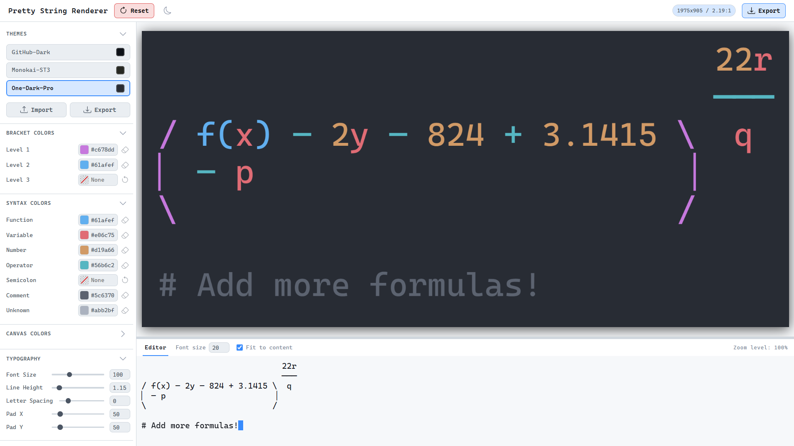
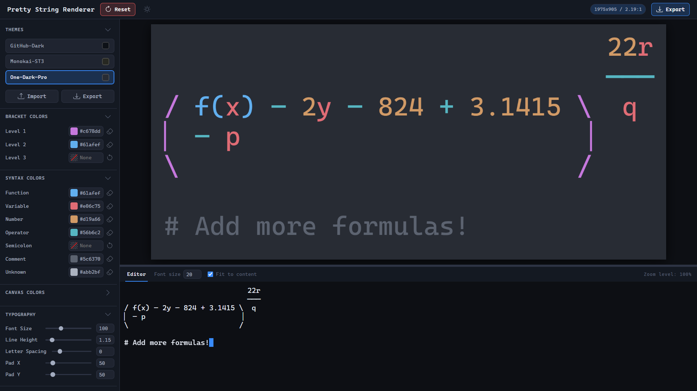
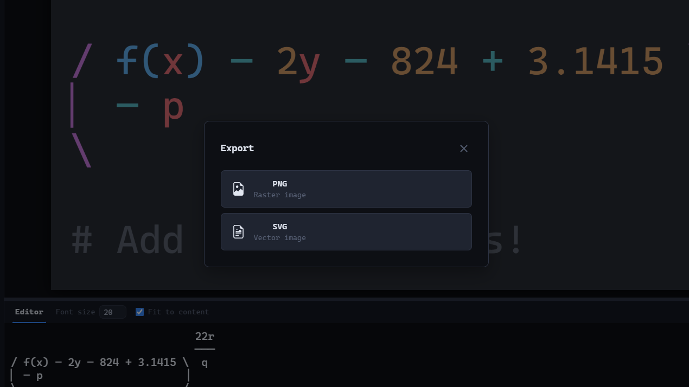
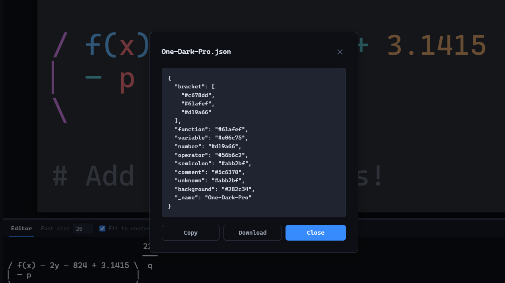
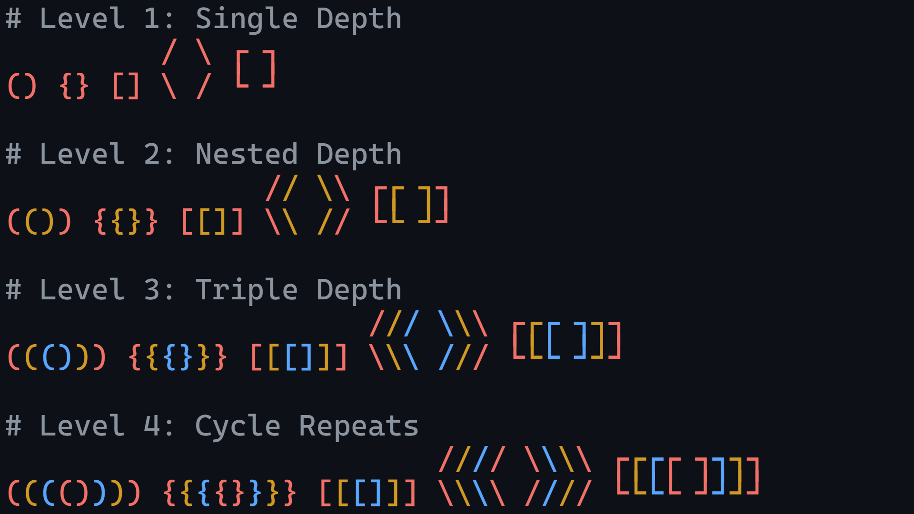

# PrettyStringRenderer

A high-fidelity monospace canvas engine for symbolic math art and code visualization. Transforms ASCII / Unicode text into colorized, high-resolution string-art suitable for screenshots, illustrations, or vector export.



---

## Table of Contents

- [Features](#features)
- [Getting Started](#getting-started)
  - [Requirements](#requirements)
  - [Installation](#installation)
  - [Run Locally](#run-locally)
- [Usage](#usage)
- [Export Options](#export-options)
- [Personalization](#personalization)
  - [Overridable Keys](#overridable-keys)
  - [Theme Format](#theme-format)
  - [Keybindings](#keybindings)
- [String-Art Syntax](#string-art-syntax)
  - [Bracket Logic](#bracket-logic)
  - [Limitations](#limitations)
- [Contributing](#contributing)
- [License](#license)

---

## Features

- **Incremental Tokenizer**: High-performance engine that only re-tokenizes changed lines.
- **Structural Bracket Support**: Inline and multiline bracket families with automatic nesting color cycles.
- **High-Resolution Export**: Export **PNG** at custom scale multipliers or editable **SVG** files.
- **Persistent State**: Workspace settings are automatically cached to `localStorage`.
- **Light & Dark Modes**: Native light and dark modes for the application UI.



- **Deep Personalization**: Comprehensive theme system and a gitignored `userData/profile.json` for local overrides.
- **Keyboard-first Workflow**: Most actions have keyboard shortcuts, all configurable via `userData/keybindings.json`.

---

## Getting Started

### Requirements

- [Node.js](https://nodejs.org/)
- [Visual Studio Code](https://code.visualstudio.com/) (Recommended)

---

### Installation

```bash
pnpm install
```

---

### Run Locally

```bash
pnpm run dev
```

Access at `http://localhost:5173`.

---

## Usage

Start typing in the canvas editor to begin. See [SHORTCUTS.md](SHORTCUTS.md) for the full list of keyboard shortcuts and mouse controls.

---

## Export Options

| format  | details                                                                                                                                            |
| ------- | -------------------------------------------------------------------------------------------------------------------------------------------------- |
| **PNG** | Raster export with custom scale multipliers (e.g., `0.5`, `1`, `2`)                                                                                |
| **SGV** | Vector export where tokens are grouped by color. Fonts are embedded as attributes, making files fully editable in Figma, Illustrator, or Inkscape. |



---

## Personalization

Create a local profile to override default settings:

```bash
cp userData/profile.example.json userData/profile.json
```

---

### Overridable Keys

| Key                        | Description                                                                                                                                                                                                    |
| -------------------------- | -------------------------------------------------------------------------------------------------------------------------------------------------------------------------------------------------------------- |
| `app.fontVariantLigatures` | `"normal"` (enable) or `"none"` (disable). See [MDN: font-variant-ligatures](https://developer.mozilla.org/en-US/docs/Web/CSS/Reference/Properties/font-variant-ligatures) for a full list of accepted values. |
| `typography.fontSize`      | Base font size for the renderer.                                                                                                                                                                               |
| `canvas.width` / `height`  | Default dimensions for the drawing area.                                                                                                                                                                       |

> See [userData/profile.example.json](userData/profile.example.json) for the full list of overridable keys.

---

### Theme Format

Themes are plain JSON objects. Every key is **nullable** and can be omitted; missing colors render as transparent.

```json
{
  "bracket": ["#569cd6", "#ffd700", "#c586c0"],
  "function": "#dcdcaa",
  "variable": "#9cdcfe"
}
```



The `bracket` array accepts any number of colors; nesting depth cycles through them automatically.

> Browse the [public/themes/](/public/themes/) folder for pre-bundled palettes.

---

### Keybindings

Create a local keybindings file to override default shortcuts:

```bash
cp userData/keybindings.example.json userData/keybindings.json
```

Keys you omit keep their defaults. Each entry maps an action to a key combination:

```json
{
  "app.fullReload": "ctrl+shift+r",
  "workspace.export": "ctrl+m"
}
```

Modifiers are `ctrl`, `shift`, and `alt`, separated by `+`. The key name is always last and matches [KeyboardEvent.key](https://developer.mozilla.org/en-US/docs/Web/API/KeyboardEvent/key/Key_Values) (case-insensitive).

> See [userData/keybindings.example.json](userData/keybindings.example.json) for every configurable action.

---

## String-Art Syntax

The tokenizer highlights the following token categories:

| Category        | Patterns                                                      |
| --------------- | ------------------------------------------------------------- |
| **Brackets**    | Inline (`()`, `[]`, `{}`) and multiline (examples below)      |
| **Identifiers** | `variables` and `functions()`                                 |
| **Literals**    | Numbers (`0`, `3.14`, `.5`) and inline comments (`# comment`) |
| **Operators**   | `+`, `-`, `*`, `>`, and semicolons `;`                        |

---

### Bracket Logic

| Feature                                                                                                  | Examples                                                                                     |
| -------------------------------------------------------------------------------------------------------- | -------------------------------------------------------------------------------------------- |
| Brackets scale dynamically; top and bottom rows are fixed, while middle arms repeat to form tall shapes. |  |
| Nesting depth cycles through the colors defined in your theme's `bracket` array.                         |                 |

---

### Limitations

- **Comments**: `#` terminates early if it encounters multiline bracket characters, intentionally, to avoid breaking shapes.

- **Reserved Characters**: `/` and `\` are reserved for multiline round-bracket arms.

- **Pairing**: The tokenizer requires paired bracket families; orphaned or split vertical segments cannot be resolved.

- **Structural Wrapping**: Wrapping multiline brackets around standard code blocks is not currently supported:

```plain
{
  // Standard code blocks are treated as individual tokens,
  // and cannot be wrapped by multiline structures.
}
```

---

## Contributing

Contributions are welcome. Suggested workflow:

1. Fork the repository.
2. Create a feature branch: `feat/my-change`.
3. Make your changes following the existing code style.
4. Include appropriate documentation or tests.
5. Commit, push, and open a pull request describing the change and the reason for it.

### Pre-commit Hooks <!-- omit in toc -->

This project uses [pre-commit](https://pre-commit.com/) to enforce code quality checks before each commit. Run once from the **repo root** to set it up:

```bash
pip install pre-commit
pre-commit install
```

Checks run automatically on every `git commit`. To run them manually:

```bash
pre-commit run --all-files
```

---

## License

This project is available under the **MIT License**.
